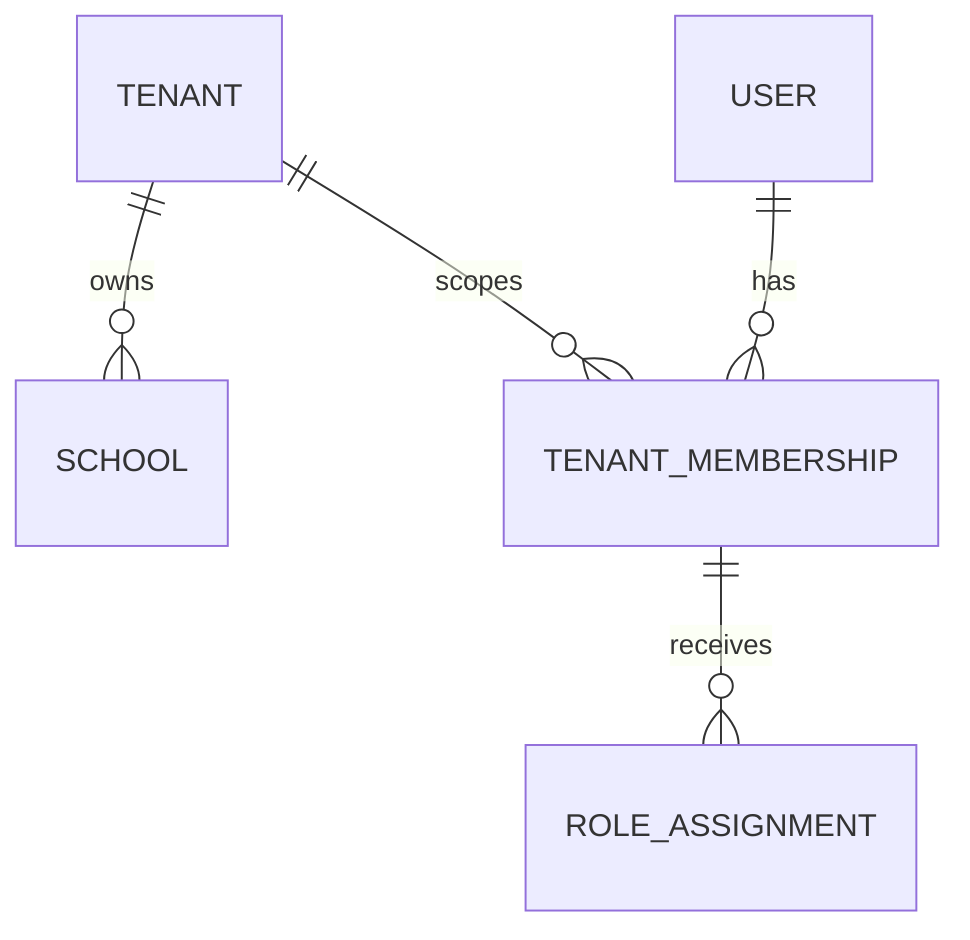
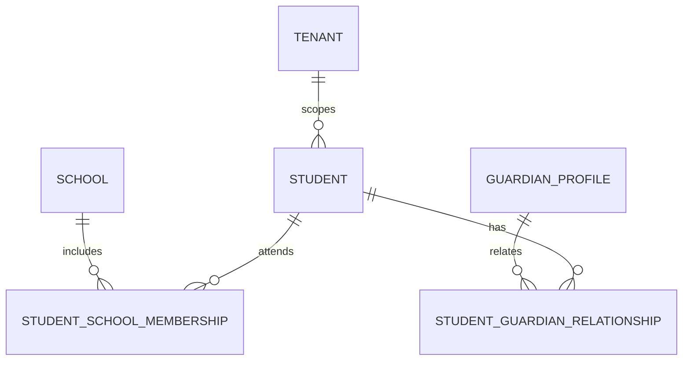
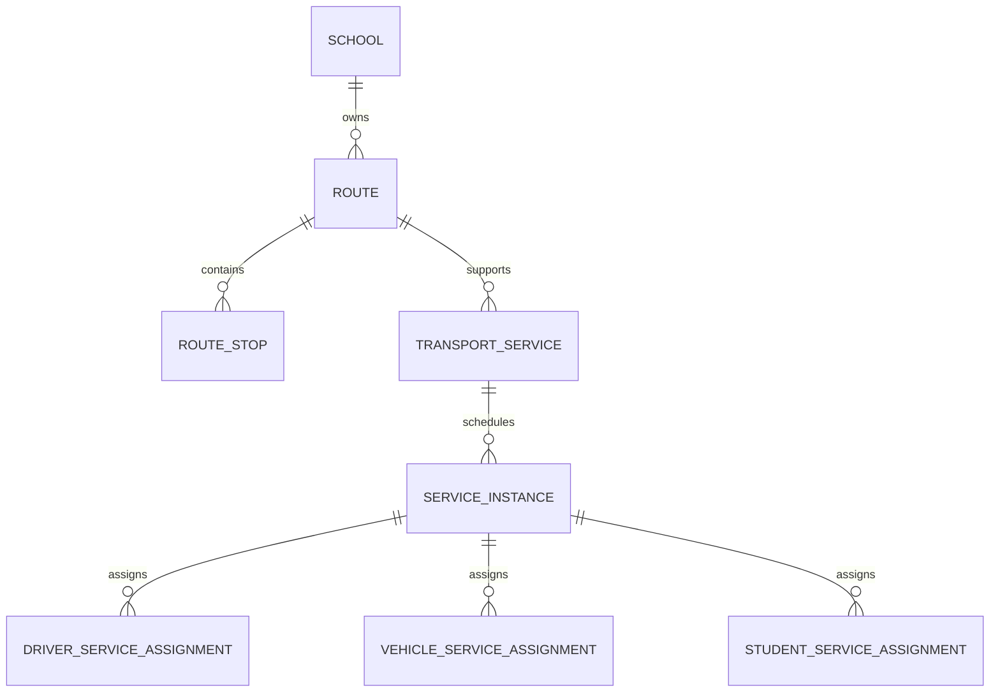
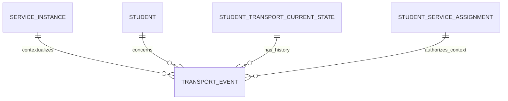
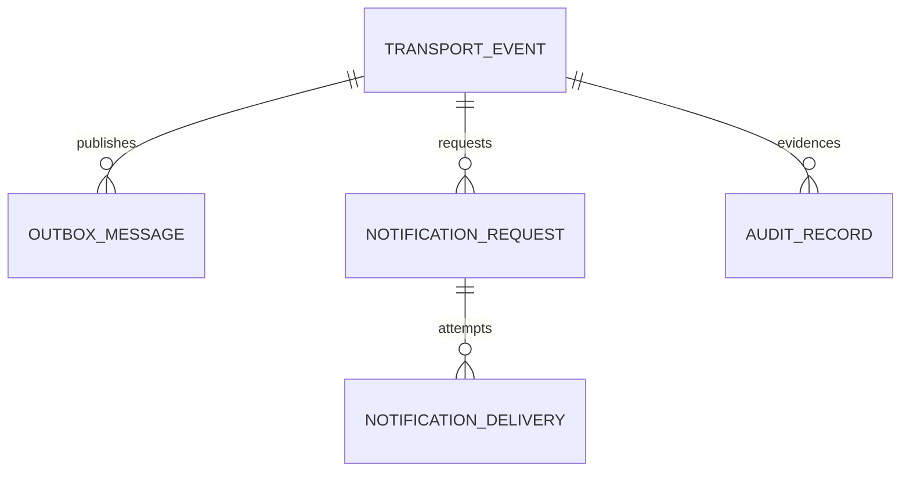

# Database Design Specification

## 1. Document Control

Phase 08 — Database Design. Status: draft for review. Technology: PostgreSQL. This is a data-model specification; no migration, SQL or application model is created.

## 2. Purpose

Define a canonical, tenant-safe and audit-ready data design that supports the approved product and architecture from pilot through scale milestones.

## 3. Scope

The model covers operational business state, append-oriented transport history, current state, read models, audit, notifications and transactional publication intent. Redis is excluded from canonical persistence.

## 4. Database Principles

PostgreSQL is canonical business state. Tenant boundaries are explicit; local capture is not authorization; committed events are append-oriented; read models never authorize; outbox intent commits atomically with its business change.

## 5. Database Architecture Context

The database supports a modular monolith first. Canonical records, current-state projections, read models, audit evidence and outbox records are logically separate responsibilities.

## 6. Data Classification

Child identity, guardian relationships, assignment/route context, device/session references and transport history are sensitive. Operational metadata is internal; aggregate metrics should minimize personal data.

## 7. Tenant Data Model

`tenant` is the top-level organization record. Tenant-scoped tables include `tenant_id`; documented platform-only reference data is the exception.

## 8. School Data Model

`school` belongs to one tenant and carries its active lifecycle. A tenant may own multiple schools; a school never crosses tenant scope.

## 9. Identity Data Model

`user` is a platform identity record with an active/disabled lifecycle. Identity data is separated from school operational profiles.

## 10. Membership and Roles

`tenant_membership` links user and tenant with lifecycle; `role_assignment` links a membership to a role. Active membership is required for tenant operations.

## 11. Student Data Model

`student` is a tenant-scoped child record. School membership is represented by `student_school_membership` when a tenant can operate multiple schools.

## 12. Parent/Guardian Data Model

`guardian_profile` is a tenant-scoped profile linked to a user where an authenticated identity exists; it supports a lifecycle independent of the user record.

## 13. Parent-Student Relationships

`student_guardian_relationship` records student, guardian, relationship type, active interval and lifecycle. It is the data basis for relationship-bound access, not authorization by itself.

## 14. Driver Data Model

`driver_profile` is tenant-scoped and references a user where applicable. Driver status is distinct from current service assignment.

## 15. Vehicle Data Model

`vehicle` belongs to a tenant, has a tenant-scoped stable fleet identifier and active/archive lifecycle. The identifier is an internal fleet identity for this slice; plate, VIN, capacity and school-level semantics are not assumed until separately approved. Tenant ownership is protected by an explicit restrictive foreign key.

## 16. Route Data Model

`route` belongs to tenant and school and represents a reusable planned route; route lifecycle is separate from any dated execution.

## 17. Route Stop Model

`route_stop` belongs to a route, has a deterministic sequence and optional operational place reference. Exact geospatial representation is deferred to approved location policy.

## 18. Service Model

`transport_service` is a recurring/business service definition tied to school and route context. It does not itself represent a specific day’s run.

## 19. Service Instance Model

`service_instance` represents a dated operational execution of a service. It supplies the bounded context for assignments and transport events.

## 20. Assignment Model

Assignments are scoped to tenant, service instance and active time. A service instance is the authoritative operational context rather than client-supplied route names.

## 21. Driver Assignment Model

`driver_service_assignment` binds an eligible driver to a service instance with lifecycle/version context. Conflicting concurrent active driver assignments require explicit business policy validation.

## 22. Vehicle Assignment Model

`vehicle_service_assignment` binds a tenant-consistent vehicle to a service instance and supports lifecycle/version context.

## 23. Student Assignment Model

`student_service_assignment` binds a student to a service instance and optional route-stop context. It is the source for assignment-bound Driver scope.

## 24. Transport Event Model

`transport_event` is append-oriented canonical history with immutable event identity, tenant/school/service/student/actor context, event type, provenance, client identity and trusted receipt/commit times.

## 25. Pickup Event Requirements

`PICKED_UP` references valid service/student/assignment context, has client/actor provenance, and is accepted only by a transaction that preserves idempotency and current-state consistency.

## 26. Drop-off Event Requirements

`DROPPED_OFF` has equivalent context and cannot silently become accepted merely because a provider or client reports success.

## 27. Transport Current-State Model

`student_transport_current_state` represents current state per tenant, student, service instance and operational date, including last accepted event reference, state version and freshness/commit timestamp.

## 28. Event Immutability

Normal application behavior never updates or deletes accepted transport history. Future corrections are new compensating/correction event types with linkage to prior evidence.

## 29. Event Ordering

Event ordering uses server commit sequence plus occurred/received timestamps. Client time is provenance, not sole ordering authority; conflicts are explicit outcomes.

## 30. Client Event Identity

Transport events carry a client-generated `client_event_id` suitable for offline retries and device provenance.

## 31. Idempotency Model

`transport_idempotency_record` or an equivalent constrained event identity uses tenant, actor/assignment context, client event identity and operation semantics. A duplicate returns the prior safe result, not a second business effect.

## 32. Offline Sync Persistence Support

Persistence supports pending/rejected/accepted reconciliation outcomes, client device context where justified, correlation IDs and rejected-evidence retention without treating local acceptance as server authorization.

## 33. Concurrency Model

Unique constraints stop duplicate identities; current-state versioning detects races; narrowly scoped transactional checks/row locking protect a state transition. No global locks are required.

## 34. Transaction Boundaries

An accepted critical transition atomically persists canonical event, current state change, required audit intent and outbox intent. Notification/provider work is outside this transaction.

## 35. Transactional Outbox Model

`outbox_message` contains durable identity, domain/event type, aggregate reference, payload-or-reference policy, creation time, processing state, attempts, next retry and processing correlation metadata.

## 36. Notification Persistence Model

`notification_request` records product notification intent, source event, recipient candidate, sensitivity class and lifecycle independently of provider delivery.

## 37. Notification Delivery State

`notification_delivery` records dispatch-time eligibility outcome and provider-facing attempt status: queued, suppressed, accepted/sent where available, failed and retry-pending. Provider acceptance is not parent acknowledgement.

## 38. Audit Data Model

`audit_record` is append-oriented evidence with audit ID, tenant, actor type/identity, action, target context, trusted timestamp, correlation, security relevance, outcome and origin/channel/device context.

## 39. Audit Integrity Requirements

Audit storage preserves ordered tamper-evident evidence and independent verification checkpoints. Normal business/admin operations cannot rewrite audit records; audit access/export is itself accountable.

## 40. Read Model Strategy

Read models are derived, tenant-scoped, rebuildable and non-authorizing. They serve operational/dashboard queries without replaying full event history.

## 41. Daily Operational Read Model

`daily_student_service_state` provides student/service/date state, last accepted event, timing/freshness and assignment context for daily school operations.

## 42. Dashboard Aggregation Model

`service_dashboard_aggregate` provides tenant/school/service/date counters and freshness markers. It does not contain more child data than dashboard purpose requires.

## 43. Reporting Data Strategy

Reporting uses authorized read models/aggregates or bounded history queries. It must not bypass tenant, retention or export controls.

## 44. Referential Integrity

Foreign keys protect stable ownership relationships. Time-sensitive authorization/assignment validity needs transaction/application validation in addition to FKs.

## 45. Tenant Integrity Constraints

Tenant-scoped references require matching tenant context by composite reference/constraint design or transactional validation; client-provided identifiers alone never establish scope.

## 46. Authorization-Supporting Relationships

Membership, role, guardian relationship, Driver-service and student-service assignment data support reliable authorization queries; they do not replace policy evaluation.

## 47. Lifecycle and Deactivation

Users, memberships, relationships, profiles, vehicles, routes and assignments use explicit active/inactive/archive states where history must survive.

## 48. Deletion Strategy

Hard deletion is exceptional and policy/legal dependent. Operational records are deactivated/archived; transport/audit history is append-only or retention-controlled.

## 49. Retention Dependencies

Child-data retention, legal hold, deletion requests and audit duration remain jurisdiction/compliance decisions. The design carries lifecycle/retention classification without inventing durations.

## 50. Sensitive Data Handling

Sensitive fields are minimized, excluded from routine logs, masked in support/export paths and queried only through tenant/role/relationship scope.

## 51. Encryption Expectations

Encryption at rest and in transit are infrastructure/platform requirements. The model marks sensitive categories so encryption, backup and export protections apply consistently.

## 52. Key Strategy

Primary keys are stable globally safe identifiers. Natural identifiers may be constrained for business uniqueness but are not primary security boundaries.

## 53. Identifier Strategy

UUIDv7 is the candidate for new critical identifiers because it is globally safe for offline/distributed generation and has time-ordering properties. It remains a candidate ADR pending Commander acceptance.

## 54. Timestamp Strategy

All durable records use trusted creation/update/commit timestamps where meaningful. Event `occurred_at`, `received_at` and `committed_at` remain semantically distinct.

## 55. Index Strategy

Indexes are justified by named access patterns, tenant scope and lifecycle filters. Index additions require observed/forecast query use, not speculative convenience.

## 56. Unique Constraints

Examples: tenant-scoped stable school/vehicle identifiers where product needs; active membership uniqueness; route-stop sequence per route; client-event/idempotency identity in its security/business scope; one current-state row per student/service/date context.

## 57. Query Access Patterns

Primary patterns: tenant+student, tenant+service/date, tenant+Driver assignment, guardian’s active children, active service/route, current state, recent events, client-event identity, audit tenant/time/actor and pending outbox work.

## 58. Hot Data Analysis

Likely hot tables are service instances, active assignments, current transport state, transport events and pending outbox. Historical audit/reporting access is separated from routine operational reads.

## 59. Hot Index Analysis

Likely hot indexes begin with tenant/service/date current-state lookup, tenant/student current status, active assignment lookup, idempotency identity and pending outbox ordering. Index contention must be measured before claims or expansion.

## 60. Write Amplification Risks

Critical transport writes update canonical event, current state, audit intent and outbox intent. Secondary projections/notifications stay asynchronous to prevent extra synchronous writes.

## 61. Partition Readiness

Transport events and audit records carry time and tenant context necessary for time-led partition readiness. Partitioning is not required for Pilot merely because it is anticipated.

## 62. Partition Strategy

Candidate evolution: time-based partitions for high-volume append history, with tenant-hotspot monitoring. Combined tenant/time partitioning is deferred until evidence justifies operational complexity.

## 63. Archival Strategy

Archival follows retention/legal policy and preserves audit/transport integrity, recoverability and authorized reporting needs. It is not an ordinary delete path.

## 64. Database Scaling Path

Scale through query/index evidence, connection control, partition readiness, read-model separation and replicas before distributed persistence changes.

## 65. Pilot Database Strategy

Pilot uses the same tenant/integrity/outbox/current-state boundaries with simple deployment and measured baseline telemetry; no partition deployment is presumed.

## 66. 10K Stage

At 10K students, evaluate dominant queries, current-state/outbox indexes, connection saturation and tenant skew using evidence.

## 67. 100K Stage

At 100K, assess history growth, read-model refresh, archive readiness, partition trigger evidence and replica candidate workloads.

## 68. 500K Stage

At 500K, validate partition operations, hot tenant isolation, write amplification and recovery behavior with measured workload evidence.

## 69. 1M+ Stage

At 1M+, use measured event volume, index/partition health, replication lag and operational ownership to decide further database scaling; no automatic microservice or distributed-store decision follows.

## 70. Read Replica Considerations

Replicas may serve authorized reporting/read models after freshness rules are defined. Critical authorization and accepted transport transition validation use canonical authority.

## 71. Backup Requirements

Authoritative business/audit data, relevant object data and configuration recovery boundaries require protected backups and ownership. Redis is never sole backup evidence.

## 72. Restore Requirements

Restore verification covers integrity, tenant boundaries, audit availability, rebuildable read models and no duplicate asynchronous effect. Exact RPO/RTO remains open.

## 73. DR Data Considerations

DR preserves PostgreSQL canonical state/audit first, then rebuilds derived models; secrets/configuration recovery follows restricted operational control.

## 74. Migration Principles

Future migrations are additive, reversible where feasible, reviewable and safe for tenant/audit/event integrity. No migration is created in this phase.

## 75. Schema Evolution Principles

Event/audit compatibility, read-model rebuildability and staged lifecycle changes guide evolution; historical evidence is not silently rewritten.

## 76. Zero/Low-Downtime Migration Expectations

Future production changes need expansion/backfill/compatibility/contract sequencing and evidence-based operational windows; no claim of zero downtime is made.

## 77. Data Correction Policy

Incorrect transport/audit-related facts use governed correction evidence rather than destructive update. Reference/profile corrections retain appropriate audit trail.

## 78. Seed/Reference Data

Roles, controlled event types and lifecycle states are reference data with governed evolution. Test/seed data must never be presented as production evidence.

## 79. Database Security

Database access follows least privilege, tenant-aware application queries, protected secrets, restricted admin operations and sensitive-data minimization.

## 80. Database Privilege Model

Application runtime, worker, migration/operations and audit-verification responsibilities require separable database privileges. Exact accounts/commands are implementation details.

## 81. Data Export Controls

Exports are tenant/role/purpose scoped, minimized, logged and subject to relationship/retention/privacy policy. Backup access is not an ordinary export path.

## 82. Observability

Database observability tracks availability, saturation, query latency, connection pressure, replica/projection lag, integrity outcomes and sensitive-data-safe diagnostics.

## 83. Database Metrics

Metrics include transaction outcome, latency, lock wait, connection use, storage growth, table/index bloat indicators and partition/read-model/outbox status where applicable.

## 84. Slow Query Monitoring

Slow-query monitoring uses query shape/fingerprint and tenant-safe context; it avoids exposing child data in diagnostics.

## 85. Integrity Monitoring

Monitor FK/constraint failures, tenant-context violations, current-state/event divergence, idempotency collisions and audit verification mismatches.

## 86. Outbox Monitoring

Monitor pending count, age, attempts, retry amplification, processing failure and dead-letter/escalation outcomes without treating Redis state as canonical.

## 87. Audit Monitoring

Monitor audit-intent persistence, verification checkpoint health, mismatch/escalation, audit access/export and downstream failure correlation.

## 88. Privacy Monitoring

Monitor sensitive export/access patterns, redaction failures, anomalous cross-tenant denial signals and diagnostic log hygiene.

## 89. Database Risks

Risks include hot tenants/indexes, outbox backlog, stale projections, retention ambiguity, audit-verifier delay, race conditions and recovery without measured RPO/RTO.

## 90. Assumptions

PostgreSQL is available as approved canonical persistence; current product surfaces require the domains listed; exact legal retention, location and policy values are not assumed.

## 91. Open Questions

Offline historical-authority exception/staleness policy; session/device parameter policy; legal retention/hold; RPO/RTO; GPS precision; pilot workload and partition trigger values.

## 92. Candidate Database ADRs

DB-ADR-001 PostgreSQL canonical store; 002 tenant ID on scoped records; 003 UUIDv7 candidate; 004 append-oriented transport events; 005 current-state projection; 006 scoped idempotency; 007 transactional outbox; 008 audit isolation; 009 partition-ready history; 010 soft delete not universal; 011 rebuildable read models; 012 cache never canonical.

## 93. ERD — Identity/Tenant

## 94. ERD — Student/Guardian

## 95. ERD — Operations

## 96. ERD — Transport

## 97. ERD — Async/Audit

## 98. Traceability Matrix

PRD offline/pickup/drop-off requirements map to transport events, idempotency, current state and assignments. Roles map to membership/relationship/assignment records. Architecture invariants map to tenant constraints, outbox, audit and non-authorizing read models.

## 99. Security Mapping

Tenant isolation maps to `tenant_id` and contextual validation; BOLA/IDOR resistance maps to scoped relationships; child privacy maps to classification/export controls; audit integrity maps to append-oriented records and checkpoints.

## 100. QA/Data Failure Mapping

Duplicate write → scoped uniqueness/idempotency; concurrent transition → version/check; Redis/FCM loss → durable outbox; projection lag → freshness marker/rebuild; restore → canonical/audit verification.

## 101. Phase Gate Checklist

- [x] 102 required documentation sections present.
- [x] Domain models, tenant integrity, transport history/current state, idempotency, outbox, audit, read models, index/partition/lifecycle/privacy and ERDs are specified.
- [ ] Specialist reviews, quality score and Commander approval pending.
- [x] No SQL, migration or application source introduced.

## 102. Audit Appendix

Evidence sources are the approved Phases 01–07 artifacts and Commander Phase 08 authorization. This document makes logical/physical design recommendations only and does not claim benchmark or production validation.

### 102.1 Logical table catalog

| Logical table | Key / tenancy | Primary responsibility | Lifecycle |
|---|---|---|---|
| `tenant`, `school` | UUID; school tenant-scoped | Organization and school boundary | active/archive |
| `user`, `tenant_membership`, `role_assignment` | user UUID; membership tenant-scoped | Identity and scoped roles | active/disabled/revoked |
| `student`, `student_school_membership` | tenant + student UUID | Child and school context | active/archive |
| `guardian_profile`, `student_guardian_relationship` | tenant + UUID | Guardian scope and relationship interval | active/revoked/history |
| `driver_profile`, `vehicle` | tenant + UUID | Operational actor/assets | active/archive |
| `route`, `route_stop`, `transport_service`, `service_instance` | tenant/school + UUID | Planned and dated transport context | active/archive/completed |
| `driver_service_assignment`, `vehicle_service_assignment`, `student_service_assignment` | tenant/service-instance + UUID | Assignment scope and version | active/revoked/history |
| `transport_event` | tenant + UUID/client event identity | Immutable canonical transport history | append-only/retention-controlled |
| `student_transport_current_state` | tenant/student/service/date | Query-efficient current state | mutable projection/versioned |
| `transport_idempotency_record` | tenant/security context/client identity | Duplicate-safe command outcome | retention-controlled |
| `outbox_message` | UUID + aggregate reference | Durable asynchronous publication intent | pending/processed/failed |
| `notification_request`, `notification_delivery` | tenant + UUID | Intent and dispatch/delivery separation | retention-controlled |
| `audit_record`, `audit_integrity_checkpoint` | tenant/context + UUID | Append-oriented audit and verification | append-only/retention-controlled |
| `daily_student_service_state`, `service_dashboard_aggregate` | tenant/service/date | Rebuildable operational/read projections | rebuildable |

### 102.2 Required physical attributes by responsibility

Every tenant-scoped record includes `tenant_id`, stable identifier, trusted creation time and lifecycle/version information where state can change. Assignment and relationship records include effective active interval. Transport events include event identity, type, student/service/assignment/actor/device/client context, `client_event_id`, occurred/received/committed times, provenance and accepted/rejected outcome linkage. Current state includes last accepted event reference, version and freshness. Outbox includes processing/attempt metadata; audit includes actor/action/target/correlation/outcome/origin and verification context.

### 102.3 Constraint and transaction allocation

Database constraints protect identifier uniqueness, stable ownership, route-stop ordering, active-scope cardinality where unambiguous and current-state uniqueness. Transactions/application validation protect time-dependent authorization, assignment validity, transition legality, tenant-context equality across runtime paths and offline historical-authority decisions. Critical transport acceptance commits event, current-state, audit intent and outbox intent together.

### 102.4 Tenant integrity invariant matrix

All cross-table references between tenant-scoped records SHALL be database-enforced as same-tenant ownership references wherever PostgreSQL constraints can express them. The model uses tenant-qualified candidate keys/composite references for school→tenant, student→school membership, guardian→student relationship, route→school, service→route, service instance→service, and Driver/vehicle/student assignment→service instance. Transport event, current state, notification, audit and outbox context are tenant-qualified and transaction-validated against the active assignment/relationship because effective time and authorization are dynamic.

Narrow exceptions are platform-only reference data and dynamic authorization decisions; neither permits a tenant-scoped row to reference another tenant merely through a client-supplied UUID. Security tests SHALL attempt forged IDs and cross-tenant joins for every matrix relation.

### 102.5 Transport state identity and serialization

The authoritative current-state identity is `(tenant_id, student_id, service_instance_id)`. `operational_date` is a denormalized consistency/query attribute derived from the service instance unless approved cross-midnight policy requires otherwise; it is not a second identity source. Many transport events form history for one current-state context; the current-state row references only the last accepted event.

Transition processing serializes on the current-state identity: create-or-lock that row in the critical transaction, compare its version/last accepted state, validate assignment effective at the proposed event context, then append event and advance version. A conflict returns an explicit reconciliation outcome. Multi-row operations use a deterministic tenant→service-instance→student order. Assignment overlap is prohibited for the same active role/context unless an explicit future policy permits precedence; overlap enforcement is a DB-ADR rather than an assumed application check.

### 102.6 Idempotency and replay contract

The idempotency scope is tenant, operation type, client event ID, originating logical device where available, actor/assignment context and immutable request fingerprint. A matching scope/fingerprint returns the previously authorized result only after current caller authorization is rechecked. A matching identity with different fingerprint/context is a collision/security event, not a retry. Replayed events remain subject to current/historically allowed authority policy and cannot disclose a prior result to a revoked or unrelated caller. Retention duration is tied to approved offline/retry policy; expiry never permits silent duplication of an already-known event.

### 102.7 Outbox worker recovery contract

Outbox delivery is at-least-once. A worker atomically claims a pending message with a lease/visibility deadline, records attempt/correlation metadata, and releases/retries on failure; expired leases are recovered by a controlled reaper. Consumers deduplicate by stable outbox message identity. Retries are bounded and dead-letter/escalation outcomes are durable. Payloads are classified: sensitive work stores a minimum reference/context or protected snapshot only when required, and consumer authorization/privacy is revalidated before use. A later mutable record cannot silently change the meaning of committed publication intent.

### 102.8 Audit evidence atomicity and trust boundary

Critical acceptance cannot commit without durable audit evidence or a durable, independently monitored audit-intent record that is guaranteed to materialize as immutable evidence. The chosen path is recorded per event class; it cannot be ambiguous. Audit writer authority, verification-checkpoint producer and checkpoint storage/control are logically separated from ordinary business administration. Verification failure creates an incident, preserves original evidence, records reconciliation and blocks any claim that the evidence was verified. Correction links are additional audit evidence, never mutations of prior evidence.

### 102.9 Sensitive export lifecycle

Sensitive export capability remains disabled until a logical export-request lifecycle is approved. If enabled, `data_export_request`/equivalent records purpose, tenant scope, requester, authorization/approval outcome, bounded data snapshot/reference, expiry, delivery/revocation state and audit correlation. Workers process only authorized, minimum-necessary scope; revocation before delivery suppresses output. Backup restore is not an export path.

### 102.10 Partition and global identity compatibility

Before time partitioning append history, the design SHALL preserve immutable event and idempotency uniqueness despite PostgreSQL partition-key uniqueness constraints. Candidate designs include partition-compatible keys plus a nonpartitioned identity/dedup registry; final mechanism is DB-ADR-018. Partitioning cannot be enabled if it weakens duplicate prevention, audit continuity or restore verification.

### 102.11 Index/access matrix

| Access pattern | Leading scope and ordering | Integrity/performance intent |
|---|---|---|
| Current student state | tenant, student, service instance | one versioned current row |
| Daily service operations | tenant, service instance, operational date | bounded current/read model lookup |
| Active Driver scope | tenant, driver, active lifecycle, service instance | assignment-bound access |
| Guardian children | tenant, guardian, active relationship | relationship-bound access |
| Event retry lookup | tenant, operation/context, client event identity | idempotent replay/collision detection |
| Recent event history | tenant, service/student, committed ordering | bounded append-history retrieval |
| Audit investigation | tenant, time, actor/action | accountable security lookup |
| Pending outbox | processing state, lease/retry time, creation ordering | worker claim/recovery |

### 102.12 Candidate DB-ADR additions

DB-ADR-013 tenant enforcement posture/composite ownership references; DB-ADR-014 current-state identity and transition serialization; DB-ADR-015 active assignment overlap policy; DB-ADR-016 outbox claim/lease/consumer-dedup and payload policy; DB-ADR-017 audit evidence atomicity/verification ownership; DB-ADR-018 partitioned-history global identity/idempotency; DB-ADR-019 index/access matrix and hot-write projection policy; DB-ADR-020 sensitive export lifecycle.
